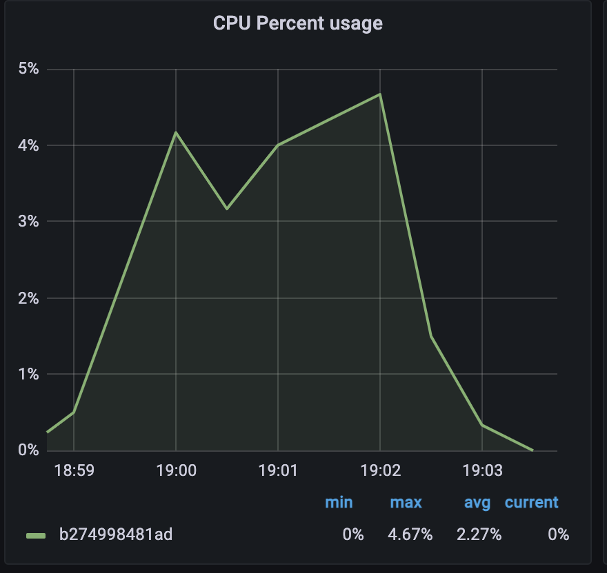
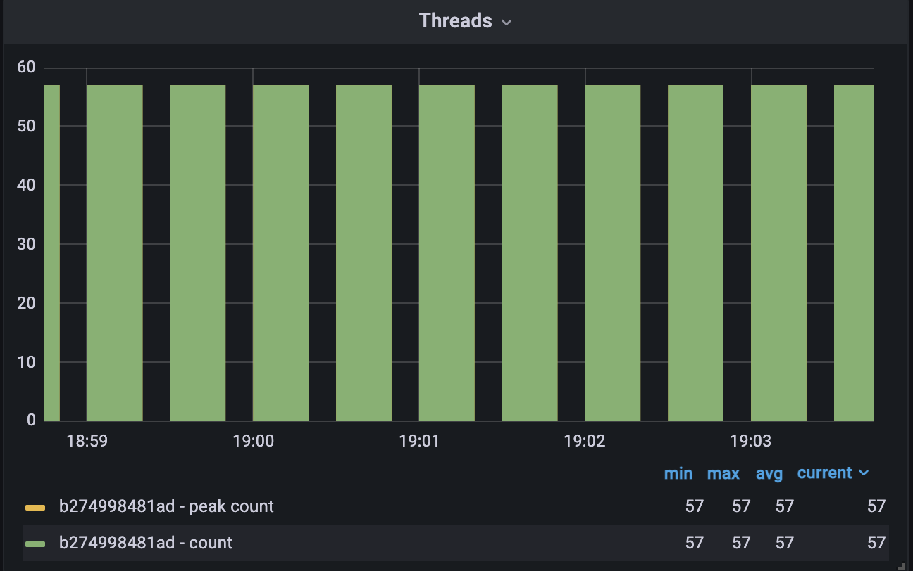
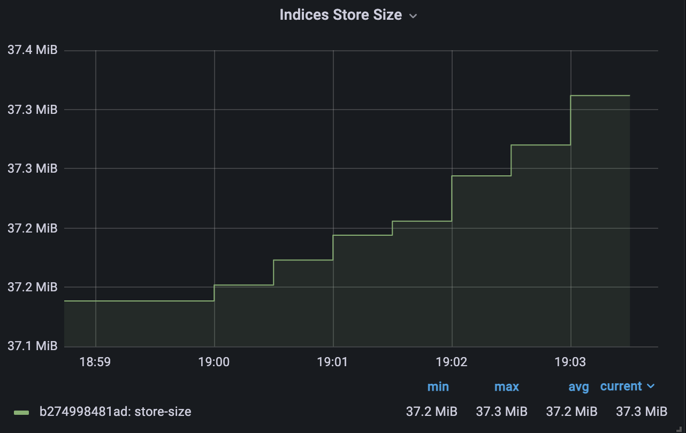
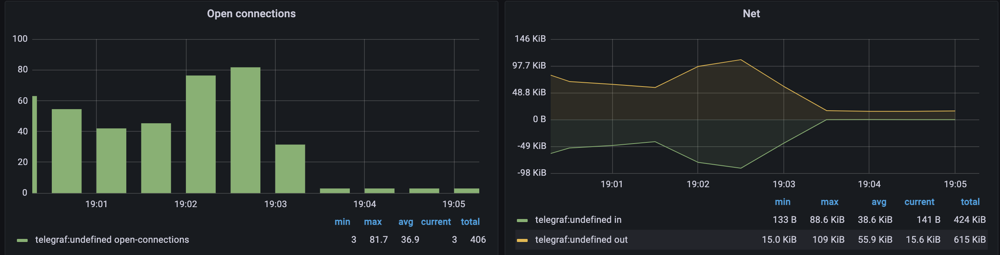
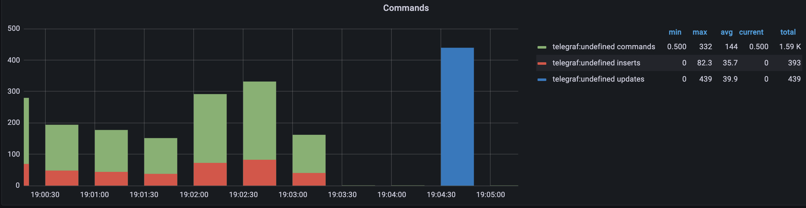
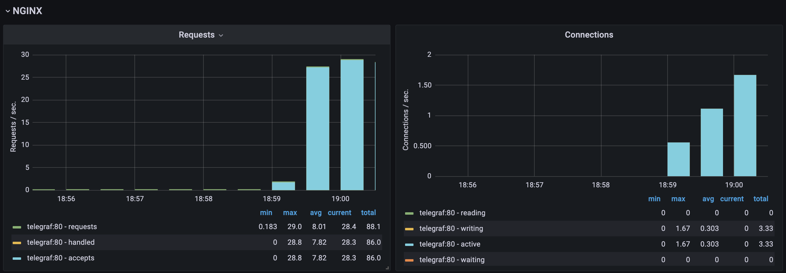

# hsal3

## Description

This project is a system monitoring application using the TIG (Telegraf, InfluxDB, Grafana) stack. The TIG stack is a powerful set of tools that provide detailed insights into system performance and metrics.

The application is built with FastAPI, a modern, fast (high-performance), web framework for building APIs with Python 3.6+ based on standard Python type hints.

Nginx is used as a reverse proxy for the FastAPI application. This setup allows us to handle more concurrent connections and offload some of the tasks from the FastAPI application, such as serving static files and handling SSL encryption.

The FastAPI application makes requests to MongoDB and Elasticsearch. MongoDB is a source of data for the application, and Elasticsearch is used for full-text search capabilities and data analytics.

The application, Nginx, MongoDB, and Elasticsearch are all containerized using Docker, making the system easy to deploy and scale.


## Elasticsearch Dashboard Results

Here are the results from the Elasticsearch dashboard:







## MongoDB Dashboard Results

Here are the results from the MongoDB dashboard:





## Nginx Dashboard Results

Here is the result from the Nginx dashboard:



## Installation

1. Ensure you have Docker and Docker Compose installed on your system. If not, you can download them from the official Docker website.

2. Clone this repository to your local machine.

3. Navigate to the project directory.

4. Run the following command to start the services:

```bash
docker-compose up
```

## Usage
```bash
python stress.py
```
Then open Grafana dashboard and you will see the results. http://localhost:3000
